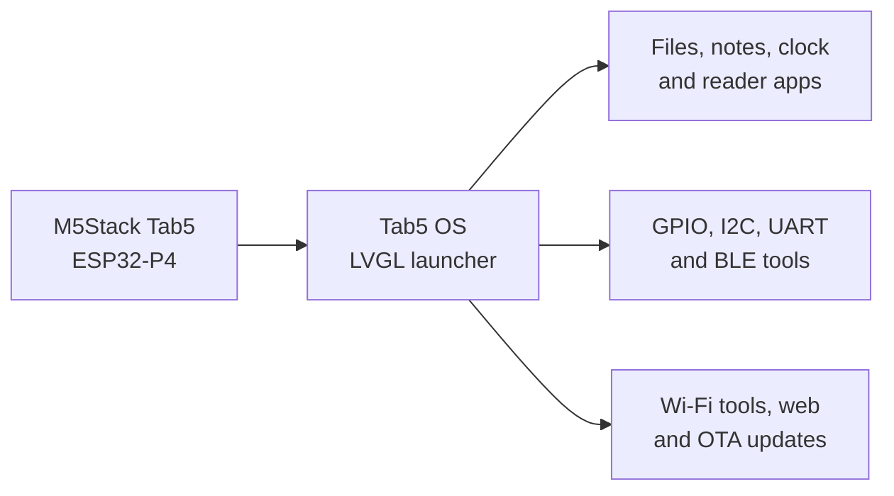

# Tab5 OS

[](https://github.com/DevanMetz/Tab5OS/actions/workflows/release.yml)

Tab5 OS is an open ESP-IDF/LVGL environment for the M5Stack Tab5. It combines a file browser with wired, BLE, and Wi-Fi tools for inspecting devices and saving field captures.

As of 2026-09-23, the latest published release is [v0.6.0](https://github.com/DevanMetz/Tab5OS/releases/tag/v0.6.0). `main` also contains a UART/RS-485 log viewer that has not been tagged. This is a field beta: the ST7121 tablet has passed the checks recorded in the [hardware smoke checklist](docs/hardware-smoke-checklist.md), while the other display family, electrical measurements, and several recovery/fault tests remain open.

## Project map



## Hardware

- M5Stack Tab5 (ESP32-P4)
- Original ILI9881C/GT911 and newer ST7123/ST7121 display variants through M5Stack's factory BSP

## Get started

- For an existing tablet, read [Install and recovery](docs/install-recovery.md) and check its partition layout before choosing an app-only, source, or factory flash. Some earlier tablets have a different layout.
- For a blank tablet or a deliberate clean recovery, download the factory image and `SHA256SUMS` from the [latest release](https://github.com/DevanMetz/Tab5OS/releases/latest), verify the hash, and follow the factory-image instructions. That path erases internal flash settings and files.
- After boot, use System to confirm the firmware version, storage, Wi-Fi, and OTA state. Saved file paths and CSV formats are in [Data formats](docs/data-formats.md).

## Toolchain

M5Stack recommends ESP-IDF v5.4.2 for Tab5. Install that exact release using Espressif's setup, then open an ESP-IDF shell.

```powershell
idf.py set-target esp32p4
idf.py build
idf.py -p <PORT> flash monitor
```

For faster Windows iteration, put the ESP-IDF directory in `.idf-path`, then use the persistent Ninja build and app-only flash wrappers:

```powershell
.\tools\build_idf.ps1
.\tools\flash_idf.ps1 -Port COM7
```

Use `-Full` after bootloader or partition-table changes, after reviewing the layout and data-migration guidance in [Install and recovery](docs/install-recovery.md). Normal source edits retain the build tree, use project-local ccache with four jobs, and flash only the app partition.

See [Install and recovery](docs/install-recovery.md) before a clean erase or when recovering a device that no longer boots. A clean factory recovery erases credentials, settings, both OTA slots, and internal SPIFFS data.

Generated note and telemetry files follow the documented [SD-card paths and CSV conventions](docs/data-formats.md).

## USB remote desktop

With Tab5 OS running over USB:

```powershell
python .\tools\remote_desktop.py --port COM7
```

The window mirrors the display at half size and sends clicks and drags back as touch input. Pass `--scale 1` for full size.

Hold the Tab5 reset button until its green LED flashes rapidly before flashing. Use `Ctrl+]` to exit the monitor.

The checked-in defaults include M5Stack's required QIO, 200 MHz PSRAM, and L2-cache settings. Removing them causes MIPI display underruns on the 720p panel.

## OTA releases

The System app installs the latest stable tagged GitHub release over Wi-Fi. Pushes and pull requests run verification; a `v*` tag publishes app-only and factory/recovery images, a versioned OTA manifest, checksums, license/notices, and pinned dependencies from the same build. The updater verifies compatibility, version, exact size, embedded app version, and SHA-256 before activation. Before a new stable tag, run the applicable [hardware smoke checks](docs/hardware-smoke-checklist.md) and disclose remaining gaps in its release notes. On a matching rollback-enabled bootloader, OTA candidates remain pending until the UI has stayed healthy for 30 seconds. Updates do not silently erase NVS settings. See the [OTA manifest contract](docs/ota-manifest.md) and [compatibility contract](docs/compatibility.md).

## Hardware safety

External GPIO and I2C signals are 3.3 V only. External 5 V is off at boot and Tab5 OS does not currently expose a control to enable it. See [pin and interface safety](docs/pin-safety.md) before connecting external hardware.

See [ROADMAP.md](ROADMAP.md) for the long-term product plan and current execution checkpoint.

Architecture, troubleshooting, privacy, contribution, security-reporting, compatibility, and hardware-test contracts live in `docs/`, [CONTRIBUTING](CONTRIBUTING.md), and [SECURITY](SECURITY.md).

For help, check [Troubleshooting](docs/troubleshooting.md) or open a [bug report](https://github.com/DevanMetz/Tab5OS/issues/new/choose). Share vulnerabilities privately through [SECURITY](SECURITY.md).

## Upstream

The vendored `components/m5stack_tab5/` board support comes from the Apache-2.0-licensed component inside M5Stack's [M5Tab5-UserDemo](https://github.com/m5stack/M5Tab5-UserDemo); that repository's root license is MIT. The ST7121 driver retains Espressif's Apache-2.0 headers. Managed dependencies are pinned in `dependencies.lock`; see [Third-party notices](THIRD_PARTY_NOTICES.md).

## Status

These features are implemented on `main`; a checked item does not mean that every hardware or fault case has passed. The [smoke checklist](docs/hardware-smoke-checklist.md) records measured coverage.

- [x] ESP32-P4 boot
- [x] Display and backlight
- [x] Touch input
- [x] SPIFFS/microSD file browser
- [x] Saved Scope and I2C capture graphs in Files, with zoom, pan, cursor values, and visible-range statistics
- [x] Saved UART and RS-485 logs in Files, with timestamped RX/TX paging, filters, and hex/ASCII views
- [x] Notes, counter, and system apps
- [x] Internet-synced RTC clock with persistent daily alarms and snooze
- [x] Milwaukee weather plus a static time/date screensaver with hourly and daily forecasts
- [x] GPIO control and eight-channel ADC oscilloscope with frequency/duty measurement, persistent calibration, and SD capture
- [x] External Grove I2C scan, 100/400 kHz byte read/watch, gated write, and SD capture on G53/G54
- [x] UART1 and onboard RS-485 terminal with line settings, ASCII/hex I/O, send history, and SD capture
- [x] Bounded SPI2 master console with selectable mode/clock and explicit M5-Bus chip-select
- [x] G6 PWM and bounded single-pulse generator with isolated LEDC resources and automatic timeout
- [x] User-controlled Govee H5075 monitoring and COLMI R12 health tools
- [x] User-controlled KICKR cycling telemetry with SD ride logging
- [x] Timed Servo Toy control on G0 with sine sweeps at selectable 0.05-1.00 Hz, random motion, isolated PWM resources, and safe output release
- [x] Persistent brightness, dimmed idle screen, and configurable timed screen-off
- [x] Recoverable notes plus durable ride, summary, ebook, and heart-rate storage paths
- [x] Wi-Fi settings with channel/RSSI scan, address details, DNS lookup, four-probe ping, and mDNS service discovery
- [x] Bounded HTTP request console with verified HTTPS, gated cleartext, capped previews, and opt-in redacted SD metadata logs
- [x] MQTT 3.1.1 publish/subscribe console with verified TLS, explicit device-local TLS profiles, QoS/retain visibility, bounded history, and opt-in payload-free SD metadata logs
- [x] Opt-in generic BLE advertisement scanner and GATT explorer with explicit connections, bounded discovery, reads, notifications, gated raw writes, and atomic evidence snapshots
- [x] AI chat client through an authenticated HTTPS relay
- [x] Start/stop microphone transcription with a live waveform
- [x] Reader-mode web browser with HTTPS and clickable links
- [x] SD-card ebook reader with three first-run Project Gutenberg classics
- [x] Application launcher
- [x] USB remote desktop
- [x] HTTPS OTA updates with rollback support on a matching bootloader and partition layout

## License

Apache-2.0. See [Third-party notices](THIRD_PARTY_NOTICES.md).
