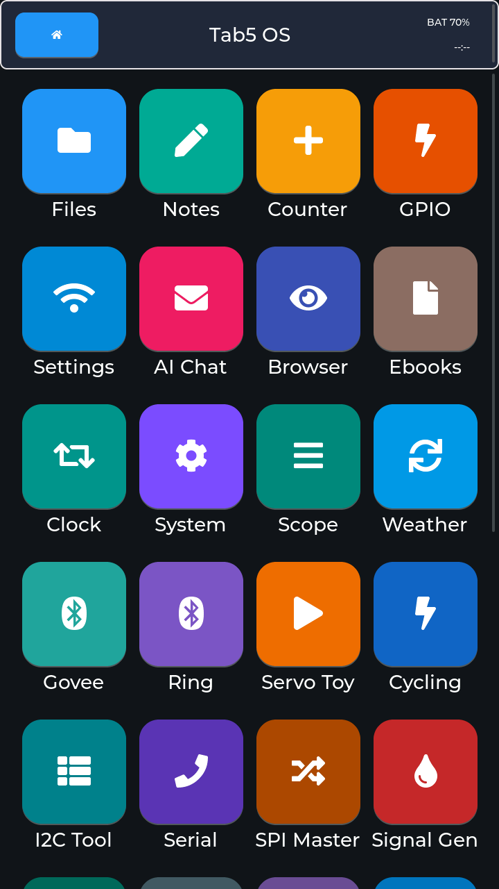
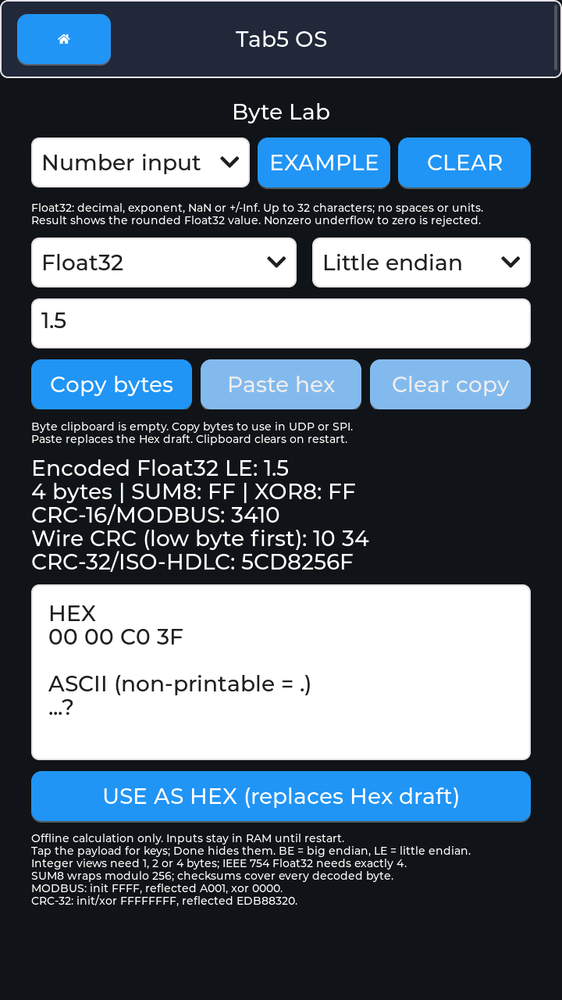
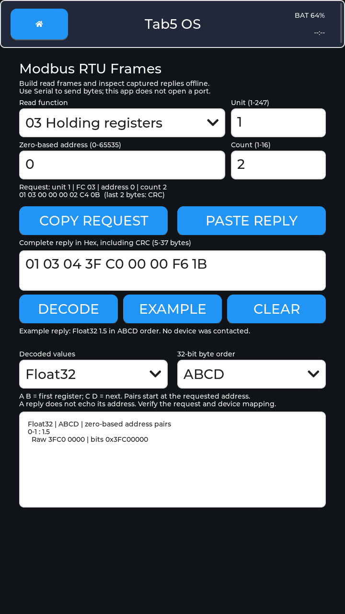
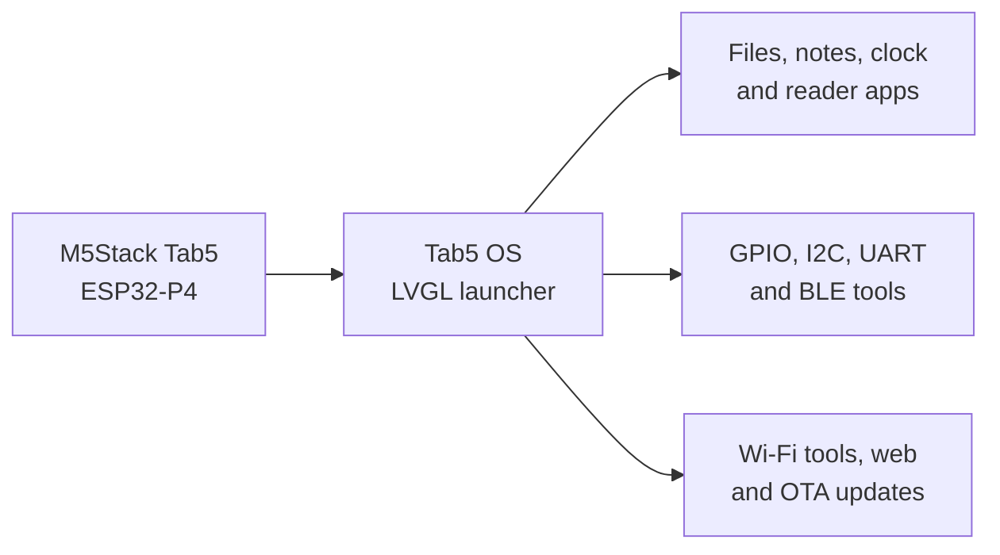

# Tab5 OS

[](https://github.com/DevanMetz/Tab5OS/actions/workflows/release.yml)

Tab5 OS is an open ESP-IDF/LVGL environment for the M5Stack Tab5. It combines a file browser with wired, BLE, and Wi-Fi tools for inspecting devices and saving field captures.

**Published field beta:** [v0.6.0](https://github.com/DevanMetz/Tab5OS/releases/tag/v0.6.0).

**Unreleased development, 2026-09-30:** `main` adds nine apps: [Electronics and Byte Lab](docs/offline-tools.md), [Subnet Lab](docs/offline-tools.md#subnet-lab), [Resistor Lab](docs/resistor-lab.md), [Modbus TCP](docs/modbus-tcp.md), [RTU Frames](docs/modbus-rtu.md), [NTP Lab and Wake-on-LAN](docs/device-network-tools.md), and [UDP Console](docs/udp-console.md). It also adds a Network launcher tile, a shared byte clipboard, saved serial log inspection, and peripheral, Wi-Fi input and runtime fixes. These additions are not included in v0.6.0.

Hardware coverage is recorded per feature and firmware image in the [smoke checklist](docs/hardware-smoke-checklist.md). The second display family, electrical/recovery/fault checks, and the recent USB brownout follow-up remain open.

## Screenshots

| Launcher | Byte Lab: encode Float32 | RTU Frames: decode a reply |
| --- | --- | --- |
| [](docs/images/launcher.png) | [](docs/images/byte-lab.png) | [](docs/images/rtu-frames.png) |

Development captures from 2026-09-29 use sample data and contain no credentials, private file contents or network/device identities. Launcher and RTU Frames are ST7121 USB captures; Byte Lab is a native LVGL host render. Click a screenshot for full size. See [capture details](docs/screenshots.md).

## Project map


```mermaid
flowchart LR
    device["M5Stack Tab5<br/>ESP32-P4"] --> os["Tab5 OS<br/>LVGL launcher"]
    os --> apps["Files, notes, clock<br/>and reader apps"]
    os --> tools["GPIO, I2C, UART<br/>and BLE tools"]
    os --> network["Wi-Fi tools, web<br/>and OTA updates"]
```

## Hardware

- M5Stack Tab5 (ESP32-P4)
- Original ILI9881C/GT911 and newer ST7123/ST7121 display variants through M5Stack's factory BSP

## Get started

- For an existing tablet, read [Install and recovery](docs/install-recovery.md) and check its partition layout before choosing an app-only, source, or factory flash. Some earlier tablets have a different layout.
- For a blank tablet or a deliberate clean recovery, download the factory image and `SHA256SUMS` from the [latest release](https://github.com/DevanMetz/Tab5OS/releases/latest), verify the hash, and follow the factory-image instructions. That path erases internal flash settings and files.
- After boot, use System to confirm the firmware version, storage, Wi-Fi, and OTA state. Saved file paths and CSV formats are in [Data formats](docs/data-formats.md).

## Toolchain

M5Stack recommends ESP-IDF v5.4.2 for Tab5. Install that exact release using Espressif's setup, then open an ESP-IDF shell.

```powershell
idf.py set-target esp32p4
idf.py build
```

Building does not require a connected tablet. For faster Windows rebuilds, put the ESP-IDF directory in `.idf-path` and use the persistent Ninja build wrapper:

```powershell
.\tools\build_idf.ps1
```

Before flashing, [read the installed partition table](docs/install-recovery.md#check-the-installed-partition-table) and check the active partition/address in System. Replace `COM7` with your device's port.

> **The app-only wrapper always writes `0x20000`; it does not detect the installed layout or active slot.** Use the command below only with the current partition table and active `ota_0` at `0x20000`. A legacy tablet may instead have a factory app at `0x20000` and active `ota_0` at `0x420000` with a 4 MiB capacity; the wrapper would update its factory slot. Do not assume `0x420000` applies to another tablet.

```powershell
# Confirm the current partition table and active ota_0 at 0x20000 first.
.\tools\flash_idf.ps1 -Port COM7
```

Complete source flashes (`idf.py flash` or the wrapper's `-Full`) also rewrite the bootloader, partition table and initial OTA metadata. A layout change does not migrate internal files. Follow [Install and recovery](docs/install-recovery.md) with a verified backup and migration plan before choosing that path.

Normal wrapper builds retain the build tree and use project-local ccache with four jobs. In a configured ESP-IDF shell, `ninja -C build -j 1 app` limits an incremental app build to one job when memory is tight. For a short build/test setup, see [Contributing quickstart](CONTRIBUTING.md#quickstart-windows-powershell).

See [Install and recovery](docs/install-recovery.md) before a clean erase or when recovering a device that no longer boots. A clean factory recovery erases credentials, settings, both OTA slots, and internal SPIFFS data.

Generated note and telemetry files follow the documented [SD-card paths and CSV conventions](docs/data-formats.md).

## USB remote desktop

With Tab5 OS running over USB:

```powershell
python .\tools\remote_desktop.py --port COM7
```

The window mirrors the display at half size and sends clicks and drags back as touch input. Pass `--scale 1` for full size.

Hold the Tab5 reset button until its green LED flashes rapidly before flashing. Use `Ctrl+]` to exit the monitor.

The checked-in defaults include M5Stack's required QIO, 200 MHz PSRAM, and L2-cache settings. Removing them causes MIPI display underruns on the 720p panel.

## OTA releases

The System app installs the latest stable tagged GitHub release over Wi-Fi. Pushes and pull requests run verification; a `v*` tag publishes app-only and factory/recovery images, a versioned OTA manifest, checksums, license/notices, and pinned dependencies from the same build. The updater verifies compatibility, version, exact size, embedded app version, and SHA-256 before activation. Before a new stable tag, run the applicable [hardware smoke checks](docs/hardware-smoke-checklist.md) and disclose remaining gaps in its release notes. On a matching rollback-enabled bootloader, OTA candidates remain pending until the UI has stayed healthy for 30 seconds. Updates do not silently erase NVS settings. See the [OTA manifest contract](docs/ota-manifest.md) and [compatibility contract](docs/compatibility.md).

## Hardware safety

External GPIO and I2C signals are 3.3 V only. External 5 V is off at boot and Tab5 OS does not currently expose a control to enable it. See [pin and interface safety](docs/pin-safety.md) before connecting external hardware.

See [ROADMAP.md](ROADMAP.md) for the long-term product plan and current execution checkpoint.

Architecture, troubleshooting, privacy, contribution, security-reporting, compatibility, and hardware-test contracts live in `docs/`, [CONTRIBUTING](CONTRIBUTING.md), and [SECURITY](SECURITY.md).

For help, check [Troubleshooting](docs/troubleshooting.md) or open a [bug report](https://github.com/DevanMetz/Tab5OS/issues/new/choose). Share vulnerabilities privately through [SECURITY](SECURITY.md).

## Upstream

The vendored `components/m5stack_tab5/` board support comes from the Apache-2.0-licensed component inside M5Stack's [M5Tab5-UserDemo](https://github.com/m5stack/M5Tab5-UserDemo); that repository's root license is MIT. The ST7121 driver retains Espressif's Apache-2.0 headers. Managed dependencies are pinned in `dependencies.lock`; see [Third-party notices](THIRD_PARTY_NOTICES.md).

## Status

These features are implemented on `main`; a checked item does not mean that every hardware or fault case has passed. The [smoke checklist](docs/hardware-smoke-checklist.md) records measured coverage.

- [x] ESP32-P4 boot
- [x] Display and backlight
- [x] Touch input
- [x] SPIFFS/microSD file browser
- [x] Saved Scope and I2C capture graphs in Files, with zoom, pan, cursor values, and visible-range statistics
- [x] Saved UART and RS-485 logs in Files, with timestamped RX/TX paging, filters, hex/ASCII views, and selected-record copy to the byte clipboard
- [x] Notes, counter, and system apps
- [x] [Offline Electronics and Byte Lab apps](docs/offline-tools.md) for circuit/RC calculations, hex/ASCII decoding, integer/Float32 encoding and interpretation, and payload checksums
- [x] [Subnet Lab](docs/offline-tools.md#subnet-lab) for offline IPv4 prefix/netmask calculations, broadcast and host ranges, and peer membership checks
- [x] [Resistor Lab](docs/resistor-lab.md) for four/five color bands, tolerance ranges, numeric/R-decimal SMD markings, and EIA-96 decoding
- [x] Internet-synced RTC clock with persistent daily alarms and snooze
- [x] Milwaukee weather plus a static time/date screensaver with hourly and daily forecasts
- [x] GPIO control and eight-channel ADC oscilloscope with frequency/duty measurement, persistent calibration, and SD capture
- [x] External Grove I2C scan, 100/400 kHz reads of 1-32 bytes, one-byte watch/SD capture, saved-read copy into Byte Lab, and gated write on G53/G54
- [x] [UART1 and onboard RS-485 terminal](docs/serial-terminal.md) with separate transmit/display formats, explicit line endings, exact byte history, clipboard paste/frozen RX copy, and SD capture
- [x] Bounded SPI2 master console with selectable mode/clock, explicit M5-Bus chip-select, and saved RX copy into Byte Lab
- [x] G6 PWM and bounded single-pulse generator with isolated LEDC resources and automatic timeout
- [x] User-controlled Govee H5075 monitoring and COLMI R12 health tools
- [x] User-controlled KICKR cycling telemetry with SD ride logging
- [x] Timed Servo Toy control on G0 with sine sweeps at selectable 0.05-1.00 Hz, random motion, isolated PWM resources, and safe output release
- [x] Persistent brightness, dimmed idle screen, and configurable timed screen-off
- [x] Recoverable notes plus durable ride, summary, ebook, and heart-rate storage paths
- [x] Wi-Fi settings with channel/RSSI scan, password Show/Hide and a compact keyboard, plus a Network launcher app for address details, DNS lookup, four-probe ping, and mDNS service discovery
- [x] [HTTP request console](docs/http-console.md) with verified HTTPS, gated cleartext, cooperative Cancel/Home, a 15-second transport budget, bounded response headers/previews, and opt-in redacted SD metadata logs
- [x] [Modbus TCP inspector](docs/modbus-tcp.md) with bounded register/coil reads, signed/unsigned/Float32 views and byte-order selection, TCP testing, exception reporting, and cancellation
- [x] [RTU Frames](docs/modbus-rtu.md) for offline Modbus read-frame construction, CRC validation, reply decoding, and request copy to Serial; native checks, firmware build, and ST7121 example/clipboard handoff pass, with wired-fixture and broader panel checks pending
- [x] [NTP Lab and Wake-on-LAN](docs/device-network-tools.md) for time-server measurements and explicitly confirmed device wake packets
- [x] [UDP Console](docs/udp-console.md) for confirmed hex/ASCII datagrams, bounded reply previews, source-port selection, and cancellation
- [x] [Shared byte clipboard](docs/offline-tools.md#move-bytes-between-apps) for preparing Byte Lab/RTU payloads in Serial, UDP, SPI or MQTT and inspecting complete captured replies without retyping
- [x] MQTT 3.1.1 publish/subscribe console with verified TLS, explicit device-local TLS profiles, QoS/retain visibility, bounded history, and opt-in payload-free SD metadata logs; COPY RX shares complete 0-128-byte binary receives with Byte Lab, and PASTE BYTES prepares an exact byte publish for explicit review/send
- [x] Opt-in generic BLE advertisement scanner and GATT explorer with explicit connections, bounded discovery, reads, notifications/indications, complete received-value copy into Byte Lab, gated raw writes, and atomic evidence snapshots
- [x] AI chat client through an authenticated HTTPS relay
- [x] Start/stop microphone transcription with a live waveform
- [x] Reader-mode web browser with HTTPS and clickable links
- [x] SD-card ebook reader with three first-run Project Gutenberg classics
- [x] Application launcher
- [x] USB remote desktop
- [x] HTTPS OTA updates with rollback support on a matching bootloader and partition layout

## License

Apache-2.0. See [Third-party notices](THIRD_PARTY_NOTICES.md).
